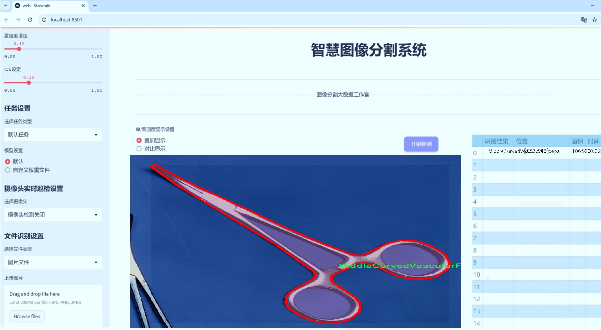
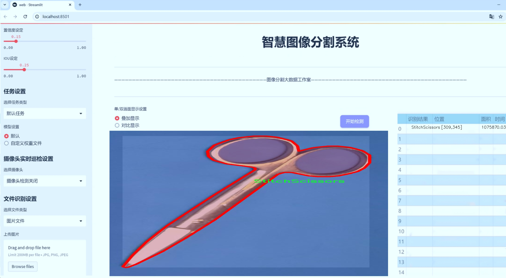
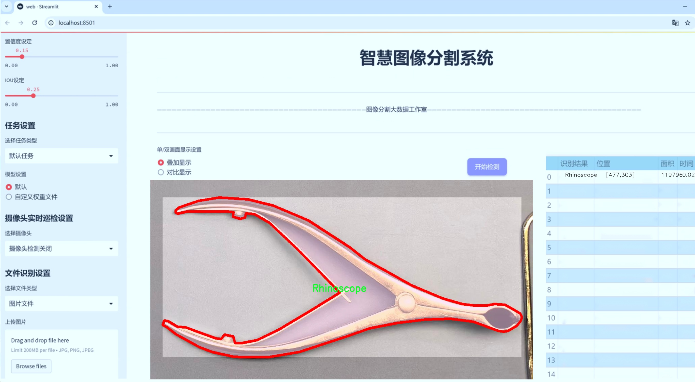
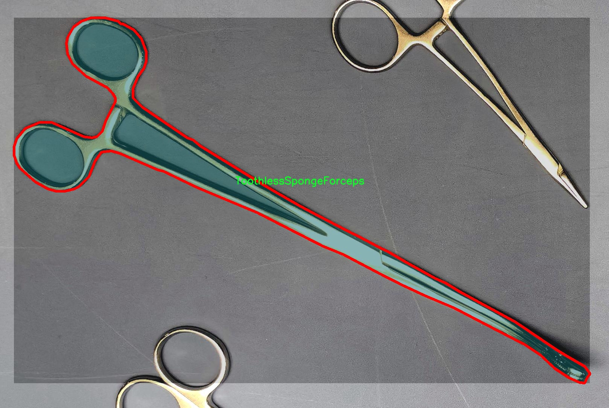
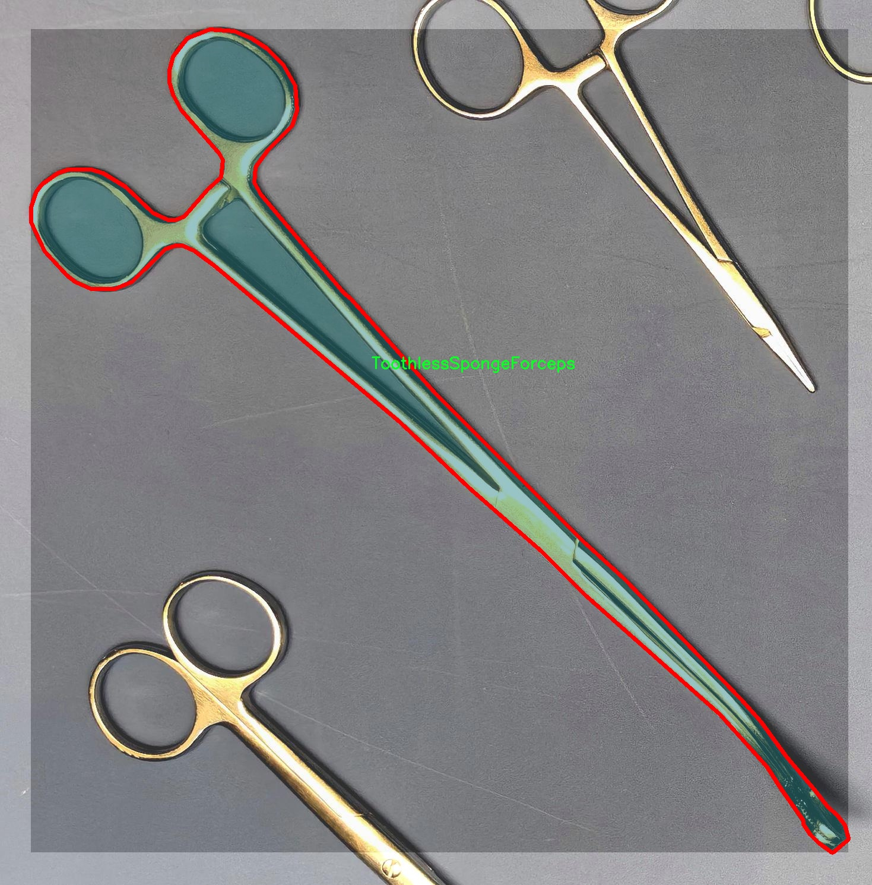
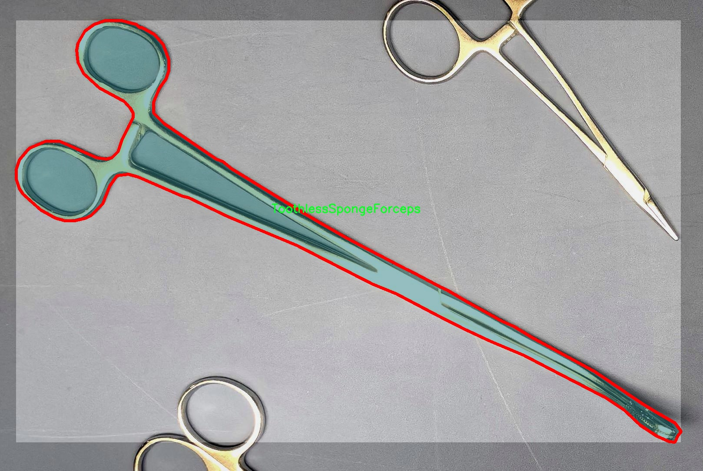
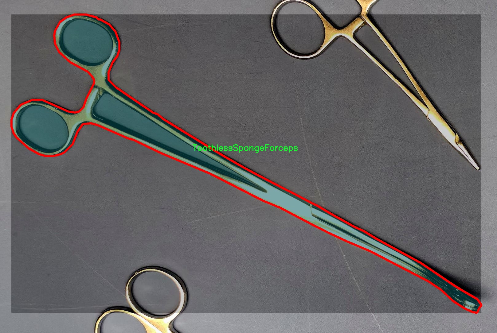
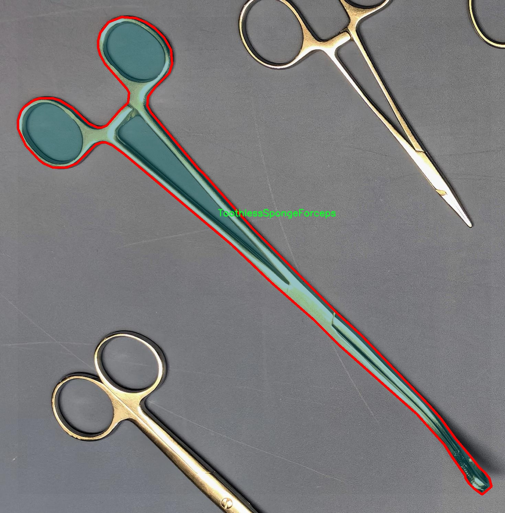

# 医疗工具实例分割系统源码＆数据集分享
 [yolov8-seg-C2f-DySnakeConv＆yolov8-seg-goldyolo等50+全套改进创新点发刊_一键训练教程_Web前端展示]

### 1.研究背景与意义

项目参考[ILSVRC ImageNet Large Scale Visual Recognition Challenge](https://gitee.com/YOLOv8_YOLOv11_Segmentation_Studio/projects)

项目来源[AAAI Global Al lnnovation Contest](https://kdocs.cn/l/cszuIiCKVNis)

研究背景与意义

随着医疗技术的不断进步，医疗工具的种类和数量日益增加，这对医疗工作者的工具管理和使用效率提出了更高的要求。医疗工具的精准识别与分类不仅能够提高手术的安全性和效率，还能在医疗培训、工具维护及库存管理等方面发挥重要作用。传统的医疗工具识别方法往往依赖于人工标注和经验判断，效率低下且容易出现误差。因此，基于计算机视觉的自动化识别技术应运而生，成为解决这一问题的有效手段。

近年来，深度学习技术的迅猛发展为图像识别领域带来了革命性的变化，尤其是实例分割技术的进步，使得对复杂场景中物体的精确识别成为可能。YOLO（You Only Look Once）系列模型以其高效的实时检测能力和良好的准确性，成为实例分割任务中的热门选择。YOLOv8作为该系列的最新版本，进一步优化了模型结构和算法，能够在保持高准确率的同时显著提高处理速度，适用于医疗工具的快速识别与分类。

本研究旨在基于改进的YOLOv8模型，构建一个高效的医疗工具实例分割系统。我们将利用包含1100张图像和16类医疗工具的“Medical_tools”数据集，进行模型的训练与测试。该数据集涵盖了多种常见的医疗工具，如KellyClamp、LanceShapedTweezers、ListeningNeedle等，具有较高的代表性和实用性。通过对这些工具的实例分割，我们希望能够实现对医疗工具的精准定位与分类，从而为医疗工作者提供有效的辅助支持。

在医疗环境中，工具的种类繁多且形态各异，传统的图像处理方法难以应对复杂的背景和光照变化。而基于YOLOv8的实例分割系统，能够通过深度学习算法自动提取特征，适应不同的环境条件，提高工具识别的准确性和鲁棒性。此外，实例分割技术不仅能够识别工具的类别，还能提供每个工具的精确轮廓信息，这对于后续的工具管理、使用记录及维护具有重要意义。

本研究的意义在于，首先为医疗工具的自动化识别提供了一种新的解决方案，能够有效提高医疗工作者的工作效率，减少因工具识别错误而导致的医疗事故。其次，通过构建医疗工具实例分割系统，我们为后续的研究提供了一个可扩展的平台，未来可以将其应用于更广泛的医疗场景中，如手术视频分析、工具使用频率统计等。最后，本研究还将为深度学习在医疗领域的应用提供有益的经验和数据支持，推动相关技术的进一步发展。

综上所述，基于改进YOLOv8的医疗工具实例分割系统的研究，不仅具有重要的理论价值，还有着广泛的实际应用前景，能够为提升医疗服务质量和效率做出积极贡献。

### 2.图片演示







##### 注意：由于此博客编辑较早，上面“2.图片演示”和“3.视频演示”展示的系统图片或者视频可能为老版本，新版本在老版本的基础上升级如下：（实际效果以升级的新版本为准）

  （1）适配了YOLOV8的“目标检测”模型和“实例分割”模型，通过加载相应的权重（.pt）文件即可自适应加载模型。

  （2）支持“图片识别”、“视频识别”、“摄像头实时识别”三种识别模式。

  （3）支持“图片识别”、“视频识别”、“摄像头实时识别”三种识别结果保存导出，解决手动导出（容易卡顿出现爆内存）存在的问题，识别完自动保存结果并导出到tempDir中。

  （4）支持Web前端系统中的标题、背景图等自定义修改，后面提供修改教程。

  另外本项目提供训练的数据集和训练教程,暂不提供权重文件（best.pt）,需要您按照教程进行训练后实现图片演示和Web前端界面演示的效果。

### 3.视频演示

[3.1 视频演示](https://www.bilibili.com/video/BV1q62JYgELF/)

### 4.数据集信息展示

##### 4.1 本项目数据集详细数据（类别数＆类别名）

nc: 16
names: ['KellyClamp', 'LanceShapedTweezers', 'ListeningNeedle', 'LongCocoaPliers', 'LongNeedleHolder', 'LongProbe', 'MiddleCurvedVascularForceps', 'NasalDilator', 'Probe', 'Rhinoscope', 'StitchScissors', 'ToothedForceps', 'ToothlessSpongeForceps', 'TowelForceps', 'VesselForceps', 'WireRetractor']


##### 4.2 本项目数据集信息介绍

数据集信息展示

在本研究中，我们使用了名为“Medical_tools”的数据集，以训练和改进YOLOv8-seg模型，旨在提升医疗工具的实例分割能力。该数据集包含16个类别的医疗工具，具体类别包括：KellyClamp、LanceShapedTweezers、ListeningNeedle、LongCocoaPliers、LongNeedleHolder、LongProbe、MiddleCurvedVascularForceps、NasalDilator、Probe、Rhinoscope、StitchScissors、ToothedForceps、ToothlessSpongeForceps、TowelForceps、VesselForceps和WireRetractor。这些工具在现代医疗实践中扮演着至关重要的角色，因此准确的实例分割不仅有助于提高手术的安全性和效率，也为医疗图像分析提供了重要的基础。

“Medical_tools”数据集的构建经过精心设计，确保了每个类别的多样性和代表性。每种工具的图像均经过严格筛选，涵盖了不同的拍摄角度、光照条件和背景环境，以模拟真实的医疗场景。这种多样性不仅增强了模型的泛化能力，还提高了其在不同临床环境下的适用性。通过对这些工具进行精确的标注，数据集为YOLOv8-seg模型提供了丰富的训练样本，使其能够学习到各类工具的独特特征和形状，从而实现高效的实例分割。

在实例分割任务中，模型需要能够准确识别并分离出每种工具的轮廓。这对于医生在手术过程中快速识别和使用工具至关重要。通过使用“Medical_tools”数据集，YOLOv8-seg模型将能够在图像中自动标记出每种工具的位置和形状，极大地减少了人工标注的工作量，同时提高了识别的准确性和效率。该数据集的设计不仅考虑了工具的外观特征，还考虑了工具在实际使用中的相对位置和交互方式，这为模型的训练提供了更为全面的上下文信息。

此外，数据集的规模和质量也为模型的训练提供了坚实的基础。通过引入多样化的图像数据，模型能够更好地适应不同的拍摄条件和工具使用场景，从而在实际应用中表现出更高的鲁棒性和准确性。数据集的丰富性使得模型在面对新类型的医疗工具时，依然能够保持较高的识别率和分割精度。

总之，“Medical_tools”数据集为改进YOLOv8-seg的医疗工具实例分割系统提供了强有力的支持。通过高质量的图像数据和精确的标注，模型能够有效地学习到医疗工具的特征，进而实现准确的实例分割。这不仅为医疗行业的智能化发展奠定了基础，也为未来的研究提供了广阔的前景。随着技术的不断进步，基于此数据集的研究成果将有望在临床实践中发挥重要作用，提升医疗服务的质量和效率。











### 5.全套项目环境部署视频教程（零基础手把手教学）

[5.1 环境部署教程链接（零基础手把手教学）](https://www.bilibili.com/video/BV1jG4Ve4E9t/?vd_source=bc9aec86d164b67a7004b996143742dc)


[5.2 安装Python虚拟环境创建和依赖库安装视频教程链接（零基础手把手教学）](https://www.bilibili.com/video/BV1nA4VeYEze/?vd_source=bc9aec86d164b67a7004b996143742dc)

### 6.手把手YOLOV8-seg训练视频教程（零基础小白有手就能学会）

[6.1 手把手YOLOV8-seg训练视频教程（零基础小白有手就能学会）](https://www.bilibili.com/video/BV1cA4VeYETe/?vd_source=bc9aec86d164b67a7004b996143742dc)


按照上面的训练视频教程链接加载项目提供的数据集，运行train.py即可开始训练



     Epoch   gpu_mem       box       obj       cls    labels  img_size
     1/200     0G   0.01576   0.01955  0.007536        22      1280: 100%|██████████| 849/849 [14:42<00:00,  1.04s/it]
               Class     Images     Labels          P          R     mAP@.5 mAP@.5:.95: 100%|██████████| 213/213 [01:14<00:00,  2.87it/s]
                 all       3395      17314      0.994      0.957      0.0957      0.0843

     Epoch   gpu_mem       box       obj       cls    labels  img_size
     2/200     0G   0.01578   0.01923  0.007006        22      1280: 100%|██████████| 849/849 [14:44<00:00,  1.04s/it]
               Class     Images     Labels          P          R     mAP@.5 mAP@.5:.95: 100%|██████████| 213/213 [01:12<00:00,  2.95it/s]
                 all       3395      17314      0.996      0.956      0.0957      0.0845

     Epoch   gpu_mem       box       obj       cls    labels  img_size
     3/200     0G   0.01561    0.0191  0.006895        27      1280: 100%|██████████| 849/849 [10:56<00:00,  1.29it/s]
               Class     Images     Labels          P          R     mAP@.5 mAP@.5:.95: 100%|███████   | 187/213 [00:52<00:00,  4.04it/s]
                 all       3395      17314      0.996      0.957      0.0957      0.0845


### 7.50+种全套YOLOV8-seg创新点代码加载调参视频教程（一键加载写好的改进模型的配置文件）

[7.1 50+种全套YOLOV8-seg创新点代码加载调参视频教程（一键加载写好的改进模型的配置文件）](https://www.bilibili.com/video/BV1Hw4VePEXv/?vd_source=bc9aec86d164b67a7004b996143742dc)

### 8.YOLOV8-seg图像分割算法原理

原始YOLOv8-seg算法原理

YOLOv8-seg算法是YOLO系列的最新进展，专注于目标检测与分割任务，融合了深度学习的最新技术与方法。相较于其前身YOLOv5，YOLOv8-seg在检测精度和速度上都取得了显著的提升，展现出更强的适应性和灵活性。YOLOv8-seg不仅仅是一个简单的目标检测算法，它在结构设计和功能实现上都进行了深度的优化，以满足多样化的应用需求。

YOLOv8-seg的网络结构可以分为四个主要部分：输入端、骨干网络、颈部网络和头部网络。输入端采用了马赛克数据增强、自适应锚框计算和自适应灰度填充等技术，以提升模型对输入数据的鲁棒性和多样性。马赛克增强技术通过将多张图像拼接成一张图像，增加了训练样本的多样性，进而提升了模型的泛化能力。此外，自适应锚框计算能够根据数据集的特征动态调整锚框的大小和比例，从而提高目标检测的准确性。

在骨干网络方面，YOLOv8-seg引入了C2f模块和SPPF（空间金字塔池化融合）结构。C2f模块的设计灵感来源于YOLOv7的ELAN结构，通过引入更多的分支和跨层连接，增强了模型的梯度流动性和特征表示能力。这种结构的优势在于能够更有效地捕捉到不同层次的特征信息，从而提高目标检测的精度。同时，SPPF结构通过多尺度特征的融合，进一步提升了模型对不同尺度目标的检测能力。

颈部网络采用了路径聚合网络（PAN）结构，这一设计使得不同尺度的特征能够进行有效的融合。PAN结构通过对特征图进行上采样和下采样操作，确保了低层特征与高层特征之间的信息传递，从而提升了模型对小目标的检测能力。这种特征融合的方式在YOLOv8-seg中得到了充分的应用，使得模型在处理复杂场景时能够保持较高的检测精度。

头部网络是YOLOv8-seg的核心部分，主要负责目标的分类和定位。在这一部分，YOLOv8-seg采用了解耦头结构，将分类和定位任务分开处理。通过两条并行的分支，模型能够分别提取类别特征和位置特征，从而提高了检测的准确性和效率。具体而言，分类分支使用了二元交叉熵损失（BCELoss）进行训练，而回归分支则结合了分布焦点损失（DFLoss）和完全交并比损失函数（CIOULoss），以增强模型对边界框预测的精准性。

在标签分配策略方面，YOLOv8-seg采用了动态标签分配策略，避免了传统方法中可能出现的候选框聚类不准确的问题。通过TOOD策略，YOLOv8-seg能够根据目标的特征动态调整正负样本的分配，确保模型在训练过程中能够有效地学习到高质量的样本。这一策略的引入，不仅提升了模型的训练效率，也提高了最终的检测性能。

值得一提的是，YOLOv8-seg在无锚框检测方面的创新，标志着目标检测技术的一次重要飞跃。传统的锚框方法往往需要手动设计和调整，而YOLOv8-seg通过直接预测目标的中心点和宽高比例，简化了检测过程，减少了计算复杂度。这种无锚框的设计理念，使得YOLOv8-seg在速度和准确性上都表现得更加优越，尤其在实时检测任务中展现出其独特的优势。

总的来说，YOLOv8-seg算法通过对网络结构的深度优化和创新，成功地提升了目标检测与分割的性能。其在数据预处理、特征提取、特征融合、损失计算等多个方面的改进，使得YOLOv8-seg在处理复杂场景和多样化目标时，能够保持高效且准确的表现。这一系列的技术进步，不仅为目标检测领域带来了新的思路，也为实际应用提供了更为强大的工具。随着YOLOv8-seg的推广与应用，未来在智能监控、自动驾驶、医疗影像等领域的潜力将会被进一步挖掘，推动相关技术的不断发展与创新。


### 9.系统功能展示（检测对象为举例，实际内容以本项目数据集为准）

图9.1.系统支持检测结果表格显示

  图9.2.系统支持置信度和IOU阈值手动调节

  图9.3.系统支持自定义加载权重文件best.pt(需要你通过步骤5中训练获得)

  图9.4.系统支持摄像头实时识别

  图9.5.系统支持图片识别

  图9.6.系统支持视频识别

  图9.7.系统支持识别结果文件自动保存

  图9.8.系统支持Excel导出检测结果数据


### 10.50+种全套YOLOV8-seg创新点原理讲解（非科班也可以轻松写刊发刊，V11版本正在科研待更新）

#### 10.1 由于篇幅限制，每个创新点的具体原理讲解就不一一展开，具体见下列网址中的创新点对应子项目的技术原理博客网址【Blog】：


[10.1 50+种全套YOLOV8-seg创新点原理讲解链接](https://gitee.com/qunmasj/good)

#### 10.2 部分改进模块原理讲解(完整的改进原理见上图和技术博客链接)【此小节的图要是加载失败请移步原始博客查看，链接：https://blog.csdn.net/cheng2333333?type=blog】
### YOLOv8简介
YOLOv8目标检测算法继承了YOLOv1系列的思考,是一种新型端到端的目标检测算法,尽管现在原始检测算法已经开源,但是鲜有发表的相关论文.YOLOv8的网络结构如图所示,主要可分为Input输入端、Backbone骨干神经网络、Neck 混合特征网络层和Head预测层网络共4个部分.

YOLO目标检测算法是一种端到端的One-Slage 目标检测算法，其核心思想是将图像按区域分块进行预测。YOLO将输入图像按照32x32的大小划分成若干个网格，例如416x416的图像将被划分为13x13个网格。当目标物体的中心位于某个网格内时,该网格就会负责输出该物体的边界框和类别置信度。每个网格可以预测多个边界框和多个目标类别,这些边界框和类别的数量可以根据需要进行设置。YOLO算法的输出是一个特征图,包含了每个网格对应的边界框和类别置信度的信息呵。本文采用YOLO最新的YOLOv8模型，其是2022年底发布的最新YOLO系列模型，采用全新的SOTA模型，全新的网络主干结构,如图1所示。
整个网络分为Backbone 骨干网络部分和Head头部网络部分。YOLOv8汲取了前几代网络的优秀特性，骨干网络和 Neck部分遵循CSP的思想，将YOLOv5中的C3模块被替换成了梯度流更丰富C2模块,去掉YOLOv5中 PAN-FPN上采样阶段中的卷积结构,将Backbone不同阶段输出的特征直接送入了上采样操作,模型提供了N/S/M/L/X尺度的不同大小模型,能够满足不同领域业界的需求。本文基于YOLOv8模型设计番茄病虫害检测系统，通过配置模型参数训练番茄图像,得到能够用于部署应用的最优模型。


### 感受野注意力卷积（RFAConv)
#### 标准卷积操作回顾
标准的卷积操作是构造卷积神经网络的基本构件。它利用具有共享参数的滑动窗口提取特征信息，克服了全连通层构造神经网络固有的参数多、计算开销大的问题。设 X R∈C×H×W
表示输入特征图，其中C、H、W分别表示特征图的通道数、高度、宽度。为了清楚地演示卷积核的特征提取过程，我们使用 C = 1 的例子。从每个接受域滑块中提取特征信息的卷积运算可以表示为:


这里，Fi 表示计算后每个卷积滑块得到的值，Xi 表示每个滑块内对应位置的像素值，K表示卷积核，S表示卷积核中的参数个数，N表示接收域滑块的总数。可以看出，每个滑块内相同位置的 feature共享相同的参数Ki。因此，标准的卷积运算并不能捕捉到不同位置所带来的信息差异，这最终在一定程度上限制了卷积神经网络的性能。 

#### 空间注意力回顾
目前，空间注意机制是利用学习得到的注意图来突出每个特征的重要性。与前一节类似，这里以 C=1为例。突出关键特征的空间注意机制可以简单表述为:这里，Fi 表示加权运算后得到的值。xi 和Ai 表示输入特征图和学习到的注意图在不同位置的值，N为输入特征图的高和宽的乘积，表示像素值的总数。


#### 空间注意与标准卷积运算
将注意力机制整合到卷积神经网络中，可以提高卷积神经网络的性能。通过对标准卷积运算和现有空间注意机制的研究，我们认为空间注意机制有效地克服了卷积神经网络固有的参数共享的局限性。目前卷积神经网络中最常用的核大小是 1 × 1和3 × 3。在引入空间注意机制后，提取特征的卷积操作可以是 1 × 1或3 × 3卷积操作。为了直观地展示这个过程，在 1 × 1卷积运算的前面插入了空间注意机制。通过注意图对输入特征图(Re-weight“×”)进行加权运算，最后通过 1 × 1卷积运算提取接收域的滑块特征信息。整个过程可以简单地表示如下:


 这里卷积核K仅代表一个参数值。如果取A i× ki 的值作为一种新的卷积核参数，有趣的是它解决了 1×1卷积运算提取特征时的参数共享问题。然而，关于空间注意机制的传说到此结束。当空间注意机制被插入到3×3卷积运算前面时。具体情况如下:


如上所述，如果取A的值 i × ki (4)式作为一种新的卷积核参数，完全解决了大规模卷积核的参数共享问题。然而，最重要的一点是，卷积核在提取每个接受域滑块的特征时，会共享一些特征。换句话说，每个接收域滑块内都有一个重叠。仔细分析后会发现A12= a21， a13 = a22， a15 = a24……，在这种情况下，每个滑动窗口共享空间注意力地图的权重。因此，空间注意机制没有考虑整个接受域的空间特征，不能有效地解决大规模卷积核的参数共享问题。因此，空间注意机制的有效性受到限制。 

#### 创新空间注意力和标准卷积操作
该博客提出解决了现有空间注意机制的局限性，为空间处理提供了一种创新的解决方案。受RFA的启发，一系列空间注意机制被开发出来，可以进一步提高卷积神经网络的性能。RFA可以看作是一个轻量级即插即用模块，RFA设计的卷积运算(RFAConv)可以代替标准卷积来提高卷积神经网络的性能。因此，我们预测空间注意机制与标准卷积运算的结合将继续发展，并在未来带来新的突破。
接受域空间特征:为了更好地理解接受域空间特征的概念，我们将提供相关的定义。接收域空间特征是专门为卷积核设计的，并根据核大小动态生成。如图1所示，以3×3卷积核为例。在图1中，“Spatial Feature”指的是原始的Feature map。“接受域空间特征”是空间特征变换后的特征图。

 

由不重叠的滑动窗口组成。当使用 3×3卷积内核提取特征时，接收域空间特征中的每个 3×3大小窗口代表一个接收域滑块。接受域注意卷积(RFAConv):针对接受域的空间特征，我们提出了接受域注意卷积(RFA)。该方法不仅强调了接收域滑块内不同特征的重要性，而且对接收域空间特征进行了优先排序。通过该方法，完全解决了卷积核参数共享的问题。接受域空间特征是根据卷积核的大小动态生成的，因此，RFA是卷积的固定组合，不能与卷积操作的帮助分离，卷积操作同时依赖于RFA来提高性能，因此我们提出了接受场注意卷积(RFAConv)。具有3×3大小的卷积核的RFAConv整体结构如图所示。


目前，最广泛使用的接受域特征提取方法是缓慢的。经过大量的研究，我们开发了一种快速的方法，用分组卷积来代替原来的方法。具体来说，我们利用相应大小的分组卷积来动态生成基于接受域大小的展开特征。尽管与原始的无参数方法(如PyTorch提供的nn.())相比，该方法增加了一些参数，但它的速度要快得多。注意:如前一节所述，当使用 3×3卷积内核提取特征时，接收域空间特征中的每个 3×3大小窗口表示一个接收域滑块。而利用快速分组卷积提取感受野特征后，将原始特征映射为新的特征。最近的研究表明。交互信息可以提高网络性能，如[40,41,42]所示。同样，对于RFAConv来说，通过交互接受域特征信息来学习注意图可以提高网络性能。然而，与每个接收域特征交互会导致额外的计算开销，因此为了最小化计算开销和参数的数量，我们使用AvgPool来聚合每个接收域特征的全局信息。然后，使用 1×1 组卷积操作进行信息交互。最后，我们使用softmax来强调每个特征在接受域特征中的重要性。一般情况下，RFA的计算可以表示为:


这里gi×i 表示一个大小为 i×i的分组卷积，k表示卷积核的大小，Norm表示归一化，X表示输入的特征图，F由注意图 a相乘得到 rf 与转换后的接受域空间特征 Frf。与CBAM和CA不同，RFA能够为每个接受域特征生成注意图。卷积神经网络的性能受到标准卷积操作的限制，因为卷积操作依赖于共享参数，对位置变化带来的信息差异不敏感。然而，RFAConv通过强调接收域滑块中不同特征的重要性，并对接收域空间特征进行优先级排序，可以完全解决这个问题。通过RFA得到的feature map是接受域空间特征，在“Adjust Shape”后没有重叠。因此，学习到的注意图将每个接受域滑块的特征信息聚合起来。换句话说，注意力地图不再共享在每个接受域滑块。这完全弥补了现有 CA和CBAM注意机制的不足。RFA为标准卷积内核提供了显著的好处。而在调整形状后，特征的高度和宽度是 k倍，需要进行 stride = k的k × k卷积运算来提取特征信息。RFA设计的卷积运算RFAConv为卷积带来了良好的增益，对标准卷积进行了创新。
此外，我们认为现有的空间注意机制应该优先考虑接受域空间特征，以提高网络性能。众所周知，基于自注意机制的网络模型[43,44,45]取得了很大的成功，因为它解决了卷积参数共享的问题，并对远程信息进行建模。然而，自注意机制也为模型引入了显著的计算开销和复杂性。我们认为，将现有的空间注意机制的注意力引导到接受场空间特征上，可以以类似于自我注意的方式解决长期信息的参数共享和建模问题。与自我关注相比，这种方法需要的参数和计算资源少得多。答案如下:(1)将以接收场空间特征为中心的空间注意机制与卷积相结合，消除了卷积参数共享的问题。(2)现有的空间注意机制已经考虑了远程信息，可以通过全局平均池或全局最大池的方式获取全局信息，其中明确考虑了远程信息。因此，我们设计了新的 CBAM和CA模型，称为RFCBAM和RFCA，它们专注于接受域空间特征。与RFA类似，使用最终的k × k stride = k 的卷积运算来提取特征信息。这两种新的卷积方法的具体结构如图 3所示，我们称这两种新的卷积操作为 RFCBAMConv和RFCAConv。与原来的CBAM相比，我们在RFCBAM中使用SE attention来代替CAM。因为这样可以减少计算开销。此外，在RFCBAM中，通道注意和空间注意不是分开执行的。相反，它们是同时加权的，使得每个通道获得的注意力地图是不同的。


### 11.项目核心源码讲解（再也不用担心看不懂代码逻辑）

#### 11.1 ui.py

以下是代码的核心部分，并添加了详细的中文注释：

```python
import sys  # 导入sys模块，用于访问与Python解释器紧密相关的变量和函数
import subprocess  # 导入subprocess模块，用于创建新进程、连接到它们的输入/输出/错误管道

def run_script(script_path):
    """
    使用当前 Python 环境运行指定的脚本。

    Args:
        script_path (str): 要运行的脚本路径

    Returns:
        None
    """
    # 获取当前 Python 解释器的路径
    python_path = sys.executable

    # 构建运行命令，使用streamlit运行指定的脚本
    command = f'"{python_path}" -m streamlit run "{script_path}"'

    # 执行命令，并等待命令完成
    result = subprocess.run(command, shell=True)
    
    # 检查命令的返回码，如果不为0，表示运行出错
    if result.returncode != 0:
        print("脚本运行出错。")

# 实例化并运行应用
if __name__ == "__main__":
    # 指定要运行的脚本路径
    script_path = "web.py"  # 这里可以直接指定脚本名，假设它在当前目录下

    # 运行指定的脚本
    run_script(script_path)
```

### 代码分析：
1. **模块导入**：
   - `sys`模块用于获取当前Python解释器的路径。
   - `subprocess`模块用于执行外部命令。

2. **`run_script`函数**：
   - 该函数接受一个脚本路径作为参数，并使用当前Python环境运行该脚本。
   - 通过`sys.executable`获取当前Python解释器的路径。
   - 构建一个命令字符串，用于调用`streamlit`运行指定的脚本。
   - 使用`subprocess.run`执行命令，并检查返回码以确定脚本是否成功运行。

3. **主程序入口**：
   - 在`__main__`模块中，指定要运行的脚本路径（这里假设脚本名为`web.py`）。
   - 调用`run_script`函数执行脚本。 

这个代码的核心功能是运行一个Streamlit应用，并在执行过程中提供错误检查。

这个程序文件 `ui.py` 的主要功能是通过当前的 Python 环境来运行一个指定的脚本，具体来说是运行一个名为 `web.py` 的脚本。文件的开头部分导入了必要的模块，包括 `sys`、`os` 和 `subprocess`，以及一个自定义的 `abs_path` 函数，这个函数来自于 `QtFusion.path` 模块，可能用于获取文件的绝对路径。

在 `run_script` 函数中，首先获取当前 Python 解释器的路径，这通过 `sys.executable` 实现。接着，构建一个命令字符串，这个命令使用了 `streamlit` 工具来运行指定的脚本。`streamlit` 是一个用于构建数据应用的框架，通常用于快速开发和展示数据可视化应用。

随后，使用 `subprocess.run` 方法来执行构建好的命令。这个方法会在一个新的进程中运行命令，并且可以捕获命令的返回状态。如果返回状态不为零，表示脚本运行过程中出现了错误，程序会打印出一条错误信息。

在文件的最后部分，使用 `if __name__ == "__main__":` 语句来确保只有在直接运行该文件时才会执行下面的代码。这里指定了要运行的脚本路径为 `web.py`，并调用 `run_script` 函数来执行这个脚本。

总体来说，这个文件的设计旨在提供一个简单的接口来运行一个 Streamlit 应用，便于开发者在本地环境中测试和展示他们的应用。

#### 11.2 ultralytics\engine\exporter.py

以下是经过简化并添加详细中文注释的核心代码部分：

```python
import json
import os
import shutil
import subprocess
import time
import warnings
from copy import deepcopy
from datetime import datetime
from pathlib import Path

import numpy as np
import torch

from ultralytics.cfg import get_cfg
from ultralytics.utils import (LOGGER, __version__, yaml_save)
from ultralytics.utils.checks import check_imgsz, check_requirements
from ultralytics.utils.torch_utils import select_device


class Exporter:
    """
    导出模型的类。

    属性:
        args (SimpleNamespace): 导出器的配置。
        callbacks (list, optional): 回调函数列表。默认为 None。
    """

    def __init__(self, cfg='default_cfg.yaml', overrides=None, _callbacks=None):
        """
        初始化 Exporter 类。

        参数:
            cfg (str, optional): 配置文件路径。默认为 'default_cfg.yaml'。
            overrides (dict, optional): 配置覆盖。默认为 None。
            _callbacks (dict, optional): 回调函数字典。默认为 None。
        """
        self.args = get_cfg(cfg, overrides)  # 获取配置
        self.callbacks = _callbacks or []  # 初始化回调函数

    def __call__(self, model=None):
        """执行导出并返回导出文件/目录列表。"""
        self.run_callbacks('on_export_start')  # 运行导出开始的回调
        t = time.time()  # 记录开始时间

        # 选择设备
        self.device = select_device('cpu' if self.args.device is None else self.args.device)

        # 检查模型的类名
        model.names = check_class_names(model.names)

        # 检查图像大小
        self.imgsz = check_imgsz(self.args.imgsz, stride=model.stride, min_dim=2)

        # 创建输入张量
        im = torch.zeros(self.args.batch, 3, *self.imgsz).to(self.device)

        # 深拷贝模型并设置为评估模式
        model = deepcopy(model).to(self.device)
        model.eval()

        # 进行一次干运行以初始化模型
        y = model(im)  # 干运行

        # 记录输出形状
        self.output_shape = tuple(y.shape) if isinstance(y, torch.Tensor) else tuple()

        # 导出模型
        f = self.export_onnx(model, im)  # 导出为 ONNX 格式

        # 完成导出
        self.run_callbacks('on_export_end')  # 运行导出结束的回调
        return f  # 返回导出文件

    def export_onnx(self, model, im):
        """导出为 ONNX 格式。"""
        f = Path("model.onnx")  # 输出文件名
        torch.onnx.export(
            model.cpu(),  # 将模型移到 CPU
            im.cpu(),  # 将输入移到 CPU
            f,  # 输出文件
            input_names=['images'],  # 输入名称
            output_names=['output0'],  # 输出名称
            dynamic_axes={'images': {0: 'batch', 2: 'height', 3: 'width'}}  # 动态轴
        )
        return f  # 返回导出文件名

    def run_callbacks(self, event: str):
        """执行给定事件的所有回调。"""
        for callback in self.callbacks.get(event, []):
            callback(self)  # 执行回调函数
```

### 代码说明：
1. **导入必要的库**：导入了处理文件、时间、警告、深度学习框架（如 PyTorch）和一些工具函数的库。
2. **Exporter 类**：这是一个用于导出模型的类，包含初始化方法和导出方法。
   - `__init__` 方法用于初始化导出器，获取配置和回调函数。
   - `__call__` 方法是导出模型的主要逻辑，选择设备、检查图像大小、进行干运行并导出模型。
3. **export_onnx 方法**：负责将模型导出为 ONNX 格式。
4. **run_callbacks 方法**：用于执行与导出过程相关的回调函数。

通过这种方式，代码的核心功能得以保留，同时注释提供了清晰的解释，便于理解代码的工作原理。

这个程序文件 `exporter.py` 是 Ultralytics YOLOv8 模型的导出模块，主要用于将训练好的 YOLOv8 PyTorch 模型导出为多种格式，以便在不同的平台和框架中使用。文件开头部分详细列出了支持的导出格式，包括 PyTorch、TorchScript、ONNX、OpenVINO、TensorRT、CoreML、TensorFlow SavedModel、TensorFlow GraphDef、TensorFlow Lite、TensorFlow Edge TPU、TensorFlow.js、PaddlePaddle 和 ncnn，并给出了每种格式的对应命令行参数和生成的模型文件名。

程序的主要功能是定义一个 `Exporter` 类，该类负责处理模型的导出过程。初始化时，`Exporter` 类会加载配置文件，并设置相应的回调函数。导出过程的核心逻辑在 `__call__` 方法中实现，首先运行导出开始的回调，然后根据用户指定的格式进行模型的导出。

在导出过程中，程序会进行一系列的检查，例如确认模型的类名、图像大小、设备类型等，确保导出过程顺利进行。接着，程序会准备输入数据并对模型进行深拷贝，确保导出时不会影响原始模型。模型会被设置为评估模式，并进行必要的融合操作，以优化导出效果。

程序中定义了多个导出方法，例如 `export_torchscript`、`export_onnx`、`export_openvino` 等，每个方法负责将模型导出为特定格式。每个导出方法都使用了装饰器 `@try_export`，该装饰器用于捕获导出过程中的异常，并记录导出成功或失败的信息。

在导出过程中，程序还会生成相应的元数据，包括模型的描述、作者、许可证、版本等信息，并将这些信息嵌入到导出的模型文件中，以便后续使用时能够提供相关的上下文信息。

最后，导出完成后，程序会运行导出结束的回调，并返回导出的文件或目录列表，供用户进一步使用。整体来看，这个文件提供了一个灵活且强大的接口，使得用户能够方便地将 YOLOv8 模型导出为多种格式，以适应不同的应用场景。

#### 11.3 ultralytics\models\yolo\pose\__init__.py

以下是代码中最核心的部分，并附上详细的中文注释：

```python
# 导入必要的模块
from .predict import PosePredictor  # 导入姿态预测器类
from .train import PoseTrainer      # 导入姿态训练器类
from .val import PoseValidator       # 导入姿态验证器类

# 定义模块的公开接口，允许外部访问的类
__all__ = 'PoseTrainer', 'PoseValidator', 'PosePredictor'
```

### 代码注释说明：

1. **导入模块**：
   - `from .predict import PosePredictor`：从当前包的 `predict` 模块中导入 `PosePredictor` 类，用于进行姿态预测。
   - `from .train import PoseTrainer`：从当前包的 `train` 模块中导入 `PoseTrainer` 类，用于训练姿态模型。
   - `from .val import PoseValidator`：从当前包的 `val` 模块中导入 `PoseValidator` 类，用于验证姿态模型的性能。

2. **定义公开接口**：
   - `__all__` 是一个特殊变量，用于定义当使用 `from module import *` 语句时，哪些类或函数是可以被导入的。在这里，公开了 `PoseTrainer`、`PoseValidator` 和 `PosePredictor` 三个类，使得用户可以直接使用这些类，而不需要知道它们的具体实现细节。

这个程序文件是Ultralytics YOLO（一个流行的目标检测和姿态估计框架）中的一个模块，具体位于`ultralytics/models/yolo/pose`目录下。文件的主要功能是导入与姿态估计相关的类，并定义了该模块的公共接口。

首先，文件顶部的注释部分表明该项目遵循AGPL-3.0许可证，并且是Ultralytics YOLO的一部分。接下来，文件通过相对导入的方式引入了三个类：`PosePredictor`、`PoseTrainer`和`PoseValidator`。这些类分别用于姿态预测、训练和验证，构成了姿态估计的核心功能。

最后，`__all__`变量定义了该模块的公共接口，指定了当使用`from module import *`语句时，哪些类会被导入。这里列出的类包括`PoseTrainer`、`PoseValidator`和`PosePredictor`，这意味着这三个类是模块的主要组成部分，用户可以直接使用它们进行姿态估计相关的操作。

总体而言，这个文件的结构简单明了，主要是为了组织和暴露姿态估计功能的相关类，方便其他模块或用户进行调用。

#### 11.4 train.py

以下是经过简化并注释的核心代码部分：

```python
import os
import torch
import yaml
from ultralytics import YOLO  # 导入YOLO模型库

if __name__ == '__main__':  # 确保该模块被直接运行时才执行以下代码
    # 设置训练参数
    workers = 1  # 数据加载的工作进程数
    batch = 8  # 每个批次的样本数量
    device = "0" if torch.cuda.is_available() else "cpu"  # 检查是否有可用的GPU

    # 获取数据集配置文件的绝对路径
    data_path = abs_path(f'datasets/data/data.yaml', path_type='current')

    # 读取YAML文件，保持原有顺序
    with open(data_path, 'r') as file:
        data = yaml.load(file, Loader=yaml.FullLoader)

    # 修改数据集中训练、验证和测试集的路径
    if 'train' in data and 'val' in data and 'test' in data:
        directory_path = os.path.dirname(data_path)  # 获取目录路径
        data['train'] = os.path.join(directory_path, 'train')  # 更新训练集路径
        data['val'] = os.path.join(directory_path, 'val')  # 更新验证集路径
        data['test'] = os.path.join(directory_path, 'test')  # 更新测试集路径

        # 将修改后的数据写回YAML文件
        with open(data_path, 'w') as file:
            yaml.safe_dump(data, file, sort_keys=False)

    # 加载YOLO模型配置文件和预训练权重
    model = YOLO(r"C:\codeseg\codenew\50+种YOLOv8算法改进源码大全和调试加载训练教程（非必要）\改进YOLOv8模型配置文件\yolov8-seg-C2f-Faster.yaml").load("./weights/yolov8s-seg.pt")

    # 开始训练模型
    results = model.train(
        data=data_path,  # 指定训练数据的配置文件路径
        device=device,  # 指定训练设备
        workers=workers,  # 指定数据加载的工作进程数
        imgsz=640,  # 输入图像的大小
        epochs=100,  # 训练的轮数
        batch=batch,  # 每个批次的样本数量
    )
```

### 代码注释说明：
1. **导入库**：导入必要的库，包括`os`、`torch`、`yaml`和YOLO模型库。
2. **主程序入口**：使用`if __name__ == '__main__':`确保只有在直接运行该脚本时才执行以下代码。
3. **训练参数设置**：
   - `workers`：设置数据加载的工作进程数。
   - `batch`：设置每个批次的样本数量。
   - `device`：检查是否有可用的GPU，如果有则使用GPU，否则使用CPU。
4. **数据集路径处理**：
   - 获取数据集配置文件的绝对路径。
   - 读取YAML文件并保持原有顺序。
   - 更新训练、验证和测试集的路径，并将修改后的数据写回YAML文件。
5. **模型加载**：加载YOLO模型的配置文件和预训练权重。
6. **模型训练**：调用`model.train()`方法开始训练模型，传入必要的参数，包括数据路径、设备、工作进程数、图像大小、训练轮数和批次大小。

这个程序文件`train.py`主要用于训练YOLO（You Only Look Once）模型，具体是YOLOv8的一个变种，主要涉及到数据集的准备、模型的加载和训练过程的设置。

程序首先导入了必要的库，包括`os`、`torch`、`yaml`和`ultralytics`中的YOLO模型。这些库分别用于文件操作、深度学习框架、YAML文件处理和YOLO模型的实现。接着，程序设置了图形界面的后端为'TkAgg'，这可能是为了后续的可视化操作。

在`__main__`块中，程序首先定义了一些训练参数，包括工作进程数`workers`、批次大小`batch`和设备类型`device`。设备类型的设置会根据是否有可用的GPU（CUDA）来决定，如果有则使用GPU，否则使用CPU。

接下来，程序通过`abs_path`函数获取数据集配置文件`data.yaml`的绝对路径，并将路径中的分隔符统一为Unix风格的斜杠。然后，程序提取出数据集的目录路径，并打开YAML文件读取数据。程序检查YAML文件中是否包含'train'、'val'和'test'字段，如果存在，则将这些字段的路径修改为当前目录下的相应子目录，并将修改后的数据写回到YAML文件中。

在模型加载部分，程序使用YOLO模型的配置文件`yolov8-seg-C2f-Faster.yaml`来创建模型实例，并加载预训练的权重文件`yolov8s-seg.pt`。程序中还提到不同模型的大小和设备要求可能不同，如果遇到报错，可以尝试使用其他模型配置文件。

最后，程序调用`model.train`方法开始训练模型，传入的数据配置文件路径、设备类型、工作进程数、输入图像大小（640x640）、训练的轮数（100个epoch）和批次大小（8）。通过这些设置，程序将启动YOLO模型的训练过程。

#### 11.5 ultralytics\nn\extra_modules\__init__.py

以下是保留的核心部分代码，并添加了详细的中文注释：

```python
# 导入模块
from .afpn import *  # 导入自适应特征金字塔网络（AFPN）相关的功能
from .attention import *  # 导入注意力机制相关的功能
from .block import *  # 导入网络中使用的基本模块或块
from .head import *  # 导入网络的头部部分，通常用于最终的分类或回归任务
from .rep_block import *  # 导入重复块，可能用于构建深层网络
from .kernel_warehouse import *  # 导入内核仓库，可能用于管理卷积核
from .dynamic_snake_conv import *  # 导入动态蛇形卷积相关的功能
from .orepa import *  # 导入OREPA（可能是某种特定的网络结构或算法）
from .RFAConv import *  # 导入RFA卷积（可能是某种改进的卷积操作）
```

### 注释说明：
1. **模块导入**：使用 `from .module import *` 的方式导入当前包中的各个模块，允许在当前命名空间中直接使用这些模块中的所有功能。
2. **功能概述**：
   - **AFPN**：自适应特征金字塔网络，通常用于处理多尺度特征，提升目标检测和分割的性能。
   - **注意力机制**：通过引入注意力机制来增强网络对重要特征的关注，提升模型的表现。
   - **基本模块**：构建神经网络的基础单元，可能包括卷积层、激活函数等。
   - **头部部分**：网络的最后一层，负责输出最终的预测结果，如分类标签或回归值。
   - **重复块**：在深度学习中常用的结构，通过重复使用相同的模块来加深网络。
   - **内核仓库**：管理和存储卷积核的工具，可能用于优化卷积操作。
   - **动态蛇形卷积**：一种特殊的卷积操作，可能用于提高特征提取的灵活性。
   - **OREPA**：可能是某种特定的网络结构或算法，具体功能需要参考相关文献。
   - **RFA卷积**：可能是改进的卷积操作，旨在提升卷积层的表现。

以上注释帮助理解每个模块的作用和用途，便于后续的代码维护和扩展。

这个程序文件是一个Python模块的初始化文件，位于`ultralytics/nn/extra_modules/`目录下。文件名为`__init__.py`，它的主要作用是将该目录标识为一个Python包，并在包被导入时自动执行一些初始化操作。

在这个文件中，使用了多个`from ... import *`语句，这意味着它从同一目录下的多个模块中导入所有的公共成员。具体来说，这些模块包括`afpn.py`、`attention.py`、`block.py`、`head.py`、`rep_block.py`、`kernel_warehouse.py`、`dynamic_snake_conv.py`、`orepa.py`和`RFAConv.py`。

通过这种方式，当用户导入`ultralytics.nn.extra_modules`包时，所有这些模块中的公共类、函数和变量都会被加载到命名空间中，用户可以直接使用它们，而无需单独导入每个模块。这种做法通常用于简化用户的使用体验，使得包的接口更加友好。

总体而言，这个`__init__.py`文件的作用是将多个模块整合到一个包中，方便用户进行调用和使用，同时也提升了代码的组织性和可维护性。

#### 11.6 ultralytics\utils\loss.py

以下是代码中最核心的部分，并附上详细的中文注释：

```python
import torch
import torch.nn as nn
import torch.nn.functional as F

class BboxLoss(nn.Module):
    def __init__(self, reg_max, use_dfl=False):
        """初始化BboxLoss模块，设置最大正则化值和DFL选项。"""
        super().__init__()
        self.reg_max = reg_max  # 最大正则化值
        self.use_dfl = use_dfl  # 是否使用分布焦点损失
        self.nwd_loss = False  # 是否使用NWD损失
        self.iou_ratio = 0.5  # IoU损失比例

    def forward(self, pred_dist, pred_bboxes, anchor_points, target_bboxes, target_scores, target_scores_sum, fg_mask):
        """计算IoU损失和DFL损失。"""
        weight = target_scores.sum(-1)[fg_mask].unsqueeze(-1)  # 计算权重
        iou = bbox_iou(pred_bboxes[fg_mask], target_bboxes[fg_mask], xywh=False, CIoU=True)  # 计算IoU

        # IoU损失
        loss_iou = ((1.0 - iou) * weight).sum() / target_scores_sum
        
        # DFL损失
        if self.use_dfl:
            target_ltrb = bbox2dist(anchor_points, target_bboxes, self.reg_max)  # 将目标框转换为分布
            loss_dfl = self._df_loss(pred_dist[fg_mask].view(-1, self.reg_max + 1), target_ltrb[fg_mask]) * weight
            loss_dfl = loss_dfl.sum() / target_scores_sum
        else:
            loss_dfl = torch.tensor(0.0).to(pred_dist.device)  # 如果不使用DFL，损失为0

        return loss_iou, loss_dfl  # 返回IoU损失和DFL损失

    @staticmethod
    def _df_loss(pred_dist, target):
        """计算分布焦点损失（DFL）。"""
        tl = target.long()  # 目标左边界
        tr = tl + 1  # 目标右边界
        wl = tr - target  # 左边权重
        wr = 1 - wl  # 右边权重
        # 计算DFL损失
        return (F.cross_entropy(pred_dist, tl.view(-1), reduction='none').view(tl.shape) * wl +
                F.cross_entropy(pred_dist, tr.view(-1), reduction='none').view(tl.shape) * wr).mean(-1, keepdim=True)

class v8DetectionLoss:
    """计算YOLO模型的训练损失。"""

    def __init__(self, model):
        """初始化v8DetectionLoss，设置模型相关属性和BCE损失函数。"""
        device = next(model.parameters()).device  # 获取模型设备
        h = model.args  # 超参数

        m = model.model[-1]  # Detect()模块
        self.bce = nn.BCEWithLogitsLoss(reduction='none')  # 二元交叉熵损失
        self.hyp = h  # 超参数
        self.stride = m.stride  # 模型步幅
        self.nc = m.nc  # 类别数量
        self.reg_max = m.reg_max  # 最大正则化值
        self.device = device  # 设备

        self.bbox_loss = BboxLoss(m.reg_max - 1).to(device)  # 初始化边界框损失

    def __call__(self, preds, batch):
        """计算损失并返回。"""
        loss, batch_size = self.compute_loss(preds, batch)  # 计算损失
        return loss.sum() * batch_size, loss.detach()  # 返回总损失和分离的损失

    def compute_loss(self, preds, batch):
        """计算边界框、类别和DFL的损失总和。"""
        loss = torch.zeros(3, device=self.device)  # box, cls, dfl
        feats = preds[1] if isinstance(preds, tuple) else preds  # 获取特征
        pred_distri, pred_scores = torch.cat([xi.view(feats[0].shape[0], self.nc, -1) for xi in feats], 2).split(
            (self.reg_max * 4, self.nc), 1)  # 分离预测分布和分数

        # 目标处理
        targets = torch.cat((batch['batch_idx'].view(-1, 1), batch['cls'].view(-1, 1), batch['bboxes']), 1)
        gt_labels, gt_bboxes = targets.split((1, 4), 2)  # 类别和边界框

        # 计算边界框损失
        if fg_mask.sum():
            loss[0], loss[2] = self.bbox_loss(pred_distri, pred_bboxes, anchor_points, target_bboxes, target_scores,
                                              target_scores_sum, fg_mask)

        return loss  # 返回损失
```

### 代码说明：
1. **BboxLoss类**：负责计算边界框的损失，包括IoU损失和可选的分布焦点损失（DFL）。
   - `__init__`方法初始化损失类，设置最大正则化值和DFL选项。
   - `forward`方法计算IoU损失和DFL损失。
   - `_df_loss`方法计算分布焦点损失。

2. **v8DetectionLoss类**：负责计算YOLO模型的训练损失。
   - `__init__`方法初始化损失类，设置模型相关属性和损失函数。
   - `__call__`方法计算并返回损失。
   - `compute_loss`方法计算边界框、类别和DFL的损失总和。

这些类是YOLO模型训练过程中损失计算的核心部分，负责评估模型预测与真实标签之间的差异。

这个文件是Ultralytics YOLO模型中的损失函数实现，主要用于目标检测、分割和姿态估计等任务。文件中定义了多个损失类，每个类实现了特定的损失计算方法。

首先，`SlideLoss`类实现了一种滑动损失函数，通过调整损失的权重来适应不同的IoU（Intersection over Union）阈值。该类的构造函数接收一个损失函数，并将其reduction模式设置为'none'，以便对每个元素单独计算损失。在`forward`方法中，根据预测值和真实值计算损失，并根据IoU值调整损失的权重。

`EMASlideLoss`类是`SlideLoss`的扩展，增加了指数移动平均（EMA）机制。它在训练过程中动态更新IoU的平均值，以便在计算损失时使用更稳定的IoU值。

`VarifocalLoss`类实现了一种变焦损失，主要用于目标检测任务。它通过加权的二元交叉熵损失来处理不同类别的样本，增强了对难分类样本的关注。

`FocalLoss`类则是对已有损失函数的封装，旨在解决类别不平衡问题。它通过引入调制因子来增加难分类样本的损失权重，从而提升模型对这些样本的学习能力。

`BboxLoss`类实现了边界框损失的计算，支持不同的IoU计算方式（如CIoU、MPDIoU等）。它可以选择是否使用分布焦点损失（DFL），并在计算损失时考虑正样本的权重。

`KeypointLoss`类用于计算关键点的损失，考虑了关键点的可见性和区域大小，以确保模型能够准确预测关键点的位置。

`v8DetectionLoss`类是YOLOv8检测模型的损失计算类，整合了多种损失计算方法，包括边界框损失、分类损失和DFL损失。它还实现了目标分配机制，通过`TaskAlignedAssigner`来分配预测框和真实框。

`v8SegmentationLoss`和`v8PoseLoss`类分别用于分割和姿态估计任务，继承自`v8DetectionLoss`，并在此基础上增加了相应的损失计算逻辑。

最后，`v8ClassificationLoss`类实现了分类任务的损失计算，使用交叉熵损失来评估预测结果与真实标签之间的差异。

总体来说，这个文件通过定义多种损失函数，支持YOLO模型在不同任务中的训练和优化，旨在提高模型的性能和准确性。

### 12.系统整体结构（节选）

### 整体功能和构架概括

该项目是基于Ultralytics YOLO框架的计算机视觉应用，主要用于目标检测、姿态估计和图像分割等任务。项目的结构清晰，功能模块化，包含多个子模块和工具，便于扩展和维护。以下是各个模块的主要功能：

- **模型训练与导出**：提供训练YOLO模型的功能，并支持将训练好的模型导出为多种格式。
- **损失函数**：实现多种损失计算方法，以支持不同的任务和优化目标。
- **数据加载与处理**：提供数据集的加载和预处理功能，确保训练和推理过程中的数据质量。
- **用户界面**：提供一个简单的用户界面，用于启动和运行模型。
- **跟踪与检测**：实现目标跟踪功能，支持实时检测和分析。

### 文件功能整理表

| 文件路径                                          | 功能描述                                                   |
|--------------------------------------------------|-----------------------------------------------------------|
| `C:\codeseg\codenew\code\ui.py`                 | 提供用户界面，运行指定的Streamlit应用。                   |
| `C:\codeseg\codenew\code\ultralytics\engine\exporter.py` | 负责将训练好的YOLO模型导出为多种格式。                    |
| `C:\codeseg\codenew\code\ultralytics\models\yolo\pose\__init__.py` | 导入与姿态估计相关的类，定义模块的公共接口。              |
| `C:\codeseg\codenew\code\demo_test_image.py`   | 进行图像测试和可视化，通常用于验证模型的效果。            |
| `C:\codeseg\codenew\code\train.py`              | 训练YOLO模型，设置数据集、模型配置和训练参数。            |
| `C:\codeseg\codenew\code\ultralytics\nn\extra_modules\__init__.py` | 整合多个额外模块，简化用户的导入操作。                    |
| `C:\codeseg\codenew\code\ultralytics\utils\loss.py` | 实现多种损失函数，用于目标检测、分割和姿态估计任务。      |
| `C:\codeseg\codenew\code\ultralytics\trackers\track.py` | 实现目标跟踪功能，支持实时检测和分析。                    |
| `C:\codeseg\codenew\code\ultralytics\nn\extra_modules\ops_dcnv3\modules\__init__.py` | 导入DCNv3模块，扩展卷积操作以提高模型性能。               |
| `C:\codeseg\codenew\code\model.py`               | 定义模型架构，包含YOLO模型的实现和相关配置。               |
| `C:\codeseg\codenew\code\ultralytics\data\loaders.py` | 提供数据加载和预处理功能，确保训练和推理过程中的数据质量。 |
| `C:\codeseg\codenew\code\ultralytics\models\sam\__init__.py` | 导入与分割相关的类，定义分割模型的公共接口。              |
| `C:\codeseg\codenew\code\ultralytics\models\yolo\detect\train.py` | 进行YOLO检测模型的训练，设置训练参数和数据处理。         |

这个表格清晰地总结了每个文件的功能，帮助理解整个项目的结构和各个模块之间的关系。

注意：由于此博客编辑较早，上面“11.项目核心源码讲解（再也不用担心看不懂代码逻辑）”中部分代码可能会优化升级，仅供参考学习，完整“训练源码”、“Web前端界面”和“50+种创新点源码”以“14.完整训练+Web前端界面+50+种创新点源码、数据集获取”的内容为准。

### 13.图片、视频、摄像头图像分割Demo(去除WebUI)代码

在这个博客小节中，我们将讨论如何在不使用WebUI的情况下，实现图像分割模型的使用。本项目代码已经优化整合，方便用户将分割功能嵌入自己的项目中。
核心功能包括图片、视频、摄像头图像的分割，ROI区域的轮廓提取、类别分类、周长计算、面积计算、圆度计算以及颜色提取等。
这些功能提供了良好的二次开发基础。

### 核心代码解读

以下是主要代码片段，我们会为每一块代码进行详细的批注解释：

```python
import random
import cv2
import numpy as np
from PIL import ImageFont, ImageDraw, Image
from hashlib import md5
from model import Web_Detector
from chinese_name_list import Label_list

# 根据名称生成颜色
def generate_color_based_on_name(name):
    ......

# 计算多边形面积
def calculate_polygon_area(points):
    return cv2.contourArea(points.astype(np.float32))

...
# 绘制中文标签
def draw_with_chinese(image, text, position, font_size=20, color=(255, 0, 0)):
    image_pil = Image.fromarray(cv2.cvtColor(image, cv2.COLOR_BGR2RGB))
    draw = ImageDraw.Draw(image_pil)
    font = ImageFont.truetype("simsun.ttc", font_size, encoding="unic")
    draw.text(position, text, font=font, fill=color)
    return cv2.cvtColor(np.array(image_pil), cv2.COLOR_RGB2BGR)

# 动态调整参数
def adjust_parameter(image_size, base_size=1000):
    max_size = max(image_size)
    return max_size / base_size

# 绘制检测结果
def draw_detections(image, info, alpha=0.2):
    name, bbox, conf, cls_id, mask = info['class_name'], info['bbox'], info['score'], info['class_id'], info['mask']
    adjust_param = adjust_parameter(image.shape[:2])
    spacing = int(20 * adjust_param)

    if mask is None:
        x1, y1, x2, y2 = bbox
        aim_frame_area = (x2 - x1) * (y2 - y1)
        cv2.rectangle(image, (x1, y1), (x2, y2), color=(0, 0, 255), thickness=int(3 * adjust_param))
        image = draw_with_chinese(image, name, (x1, y1 - int(30 * adjust_param)), font_size=int(35 * adjust_param))
        y_offset = int(50 * adjust_param)  # 类别名称上方绘制，其下方留出空间
    else:
        mask_points = np.concatenate(mask)
        aim_frame_area = calculate_polygon_area(mask_points)
        mask_color = generate_color_based_on_name(name)
        try:
            overlay = image.copy()
            cv2.fillPoly(overlay, [mask_points.astype(np.int32)], mask_color)
            image = cv2.addWeighted(overlay, 0.3, image, 0.7, 0)
            cv2.drawContours(image, [mask_points.astype(np.int32)], -1, (0, 0, 255), thickness=int(8 * adjust_param))

            # 计算面积、周长、圆度
            area = cv2.contourArea(mask_points.astype(np.int32))
            perimeter = cv2.arcLength(mask_points.astype(np.int32), True)
            ......

            # 计算色彩
            mask = np.zeros(image.shape[:2], dtype=np.uint8)
            cv2.drawContours(mask, [mask_points.astype(np.int32)], -1, 255, -1)
            color_points = cv2.findNonZero(mask)
            ......

            # 绘制类别名称
            x, y = np.min(mask_points, axis=0).astype(int)
            image = draw_with_chinese(image, name, (x, y - int(30 * adjust_param)), font_size=int(35 * adjust_param))
            y_offset = int(50 * adjust_param)

            # 绘制面积、周长、圆度和色彩值
            metrics = [("Area", area), ("Perimeter", perimeter), ("Circularity", circularity), ("Color", color_str)]
            for idx, (metric_name, metric_value) in enumerate(metrics):
                ......

    return image, aim_frame_area

# 处理每帧图像
def process_frame(model, image):
    pre_img = model.preprocess(image)
    pred = model.predict(pre_img)
    det = pred[0] if det is not None and len(det)
    if det:
        det_info = model.postprocess(pred)
        for info in det_info:
            image, _ = draw_detections(image, info)
    return image

if __name__ == "__main__":
    cls_name = Label_list
    model = Web_Detector()
    model.load_model("./weights/yolov8s-seg.pt")

    # 摄像头实时处理
    cap = cv2.VideoCapture(0)
    while cap.isOpened():
        ret, frame = cap.read()
        if not ret:
            break
        ......

    # 图片处理
    image_path = './icon/OIP.jpg'
    image = cv2.imread(image_path)
    if image is not None:
        processed_image = process_frame(model, image)
        ......

    # 视频处理
    video_path = ''  # 输入视频的路径
    cap = cv2.VideoCapture(video_path)
    while cap.isOpened():
        ret, frame = cap.read()
        ......
```


### 14.完整训练+Web前端界面+50+种创新点源码、数据集获取


# [下载链接：https://mbd.pub/o/bread/ZpyXlZ1v](https://mbd.pub/o/bread/ZpyXlZ1v)